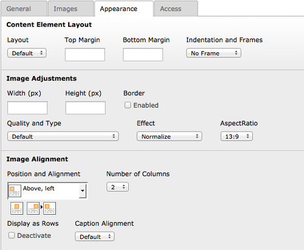

.. ==================================================
.. FOR YOUR INFORMATION
.. --------------------------------------------------
.. -*- coding: utf-8 -*- with BOM.

.. include:: ../Includes.txt

.. _introduction:

Introduction
============

.. _what-it-does:

What does it do?
----------------

- individual cropping for each thumbnail in content elements
- crop all thumbnails with fixed aspect ratio within a content element (detection for portrait and landscape)
- thumbnails with fixed aspect ratio can have individual crops with the correct aspect ratio
- uses imgareaselect for cropping

.. _screenshots:

Screenshots
-----------

		set aspect ratio for all image elements
